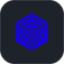
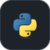

  

  
  
  

---

### 👋 About Me

Technical Lead with 5+ years in DevOps and platform engineering, currently leading DevOps strategy and governance for a **PCI DSS-regulated fintech payment platform**, with a strong **DevSecOps** focus — shift-left security, SAST/SCA, SIEM.

Own cross-team architecture reviews, FinOps adoption, and PCI-DSS/ISO 27001 audit engagements, on top of hands-on ownership of multi-cluster Kubernetes (GKE) infrastructure, GitOps, and observability. Experienced mentoring engineers and standardizing SOPs/governance guardrails to balance delivery speed against production-access risk.

- 🏦 Leading DevOps strategy & governance for a PCI DSS-regulated fintech payment platform
- 🔐 DevSecOps: shift-left security, SAST/SCA, SIEM
- ☸️ Hands-on ownership of multi-cluster Kubernetes (GKE), GitOps & observability
- 📋 Cross-team architecture reviews, FinOps adoption, PCI-DSS/ISO 27001 audits
- 🧑‍🏫 Mentoring engineers & standardizing SOPs / governance guardrails
- 🗣️ English & Indonesian native speaker

---

### 🧱 I Build Infra With

  
  
  
  
  
  
  
  
  
  
  
  
  
  
  
  
  
  
  
  
  
  
  
  
  
  
  
  
  
  
  
  
  
  
  
  
  
  
  
  
  

---

<!-- ### 💻 Coding Activity -->

<!--START_SECTION:waka-->
<!--END_SECTION:waka-->

---

> *"Tell me and I forget, teach me and I remember, involve me and I learn."*
> — Benjamin Franklin

  Thanks for visiting 👋

